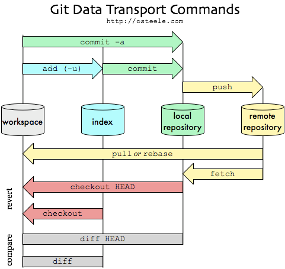

# Introduction-to-Git-and-GitHub

Git is the most popular distributed version control system. 
Git is an open source and it is created by the same people who developed Linux (Linus Torvalds).
Git allows you to track files and file changes in a repository “repo” (folder).
Everything is stored in local repositories on your computer.
Git makes changes and tracks modifications to the files stored in GitHub.
Git synchronize repository and code between different people.

GitHub is version control repository and Internet hosting service.
It is store repos and files online. It is like Dropbox for Git repos. 

Git and GitHub help to create and manage projects, and more importantly, they allow team members to change and collaborate on the projects.

Links:

* [Link to Git]	(https://git-scm.com/)
* [Link to Github] (https://github.com/)

* [Link to Pro Git book(including Git Basics)] (https://git-scm.com/book/en/v2/)

## Download and install Git. 

* [Link to Git Windows]  (http://git-scm.com/download/win) follow default settings
*  **Linux (Debian)  - Command**     sudo apt-get install git

Open Git Bash (Windows)

cd Desktop

mkdir GitWD

cd GitWD/

======

cd Desktop/GitWD/yourClonedRepo

======

**git status --help**  To get help on a particular git command    

## Setup git on your computer

**git config --global user.name "your name"**

**git config --global user.email "example@gmail.com"**

**git config --list**

Note! You will need to use the same email address for Git and GitHub.

 

## Git commands

The **git init** command creates a new Git repository.

The **git clone  url or path** copies an existing Git repository. (This can either be a repository stored locally on your computer, or one that exists remotely on the GitHub website).

The **git add .** command tells Git to add all file to a temporary "staging area". 

The **git commit -m "updated"** tells Git to save a snapshot of your files that are currently in the staging area.
 Once you have committed your changes, Git will add that snapshot to its history. 
In future you can revert your code to that particular point in time. 

The **git push origin master** send all commited changes to remote repository - GitHub.

The **git status** command tells you a useful summary of the current status of your repository. 

The **git log** command will show you a list of all those commits, with a unique ID, a timestamp and a message.

The **git diff** will show you a list of all the changes that you have made in your files - compared to the version that you last committed to Git.

The **git pull** retrives changes from remote repository

## Setup GitHub account 
Sign up or sign in, if you have existing account.
 
* [Link to GitHub] (https://github.com/)

## Star, Fork and Clone or Download buttons

* If you like the repo, you can click **Star** button. The repo will be filtered by star in your GitHub.

* The **Fork** button allows you to copy and save repo to your GitHub. This will allow you to contribute with others on that repository.

*   **Clone or Download** button will allows you to clone URL or download zip file.

## Practice exercise 1 Create your first repo in GitHub
  
  Public is a default and it is free but the content of the repo is available to everyone. 

  It is better to add README.md file.

[My solution to exercise 1](exercises/SolutionToExercise1.txt) 

## Markdown is a way to style text on the web.

* [Link to Mastering markdown]	(https://guides.github.com/features/mastering-markdown/)

* [Link to Markdown-Cheatsheet]	(https://github.com/adam-p/markdown-here/wiki/Markdown-Cheatsheet)

## Practice exercise 2   Update your repo 

   Clone your repo to your computer. 

   Update README.md locally and push to your remore repository (GitHub).

You do not need to initialize repo **git init** if you cloned the repo to your computer. If you just started Git follow the below commands

[My solution to exercise 2](exercises/SolutionToExercise2.txt) 

## Practice exercise 3 Update and add files to your repo
  Update your README.md and add files and folders to your local repository and push to your remote repository (GitHub).

[My solution to exercise 3](exercises/SolutionToExercise3.txt) 

##
**To remove repository from GitHub**    > Settings > Delete this repository > Type repository name
##

If you find any typos please let me know. Thanks
