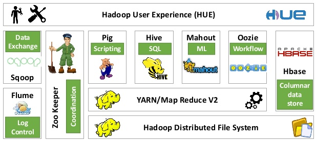
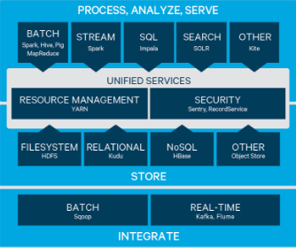
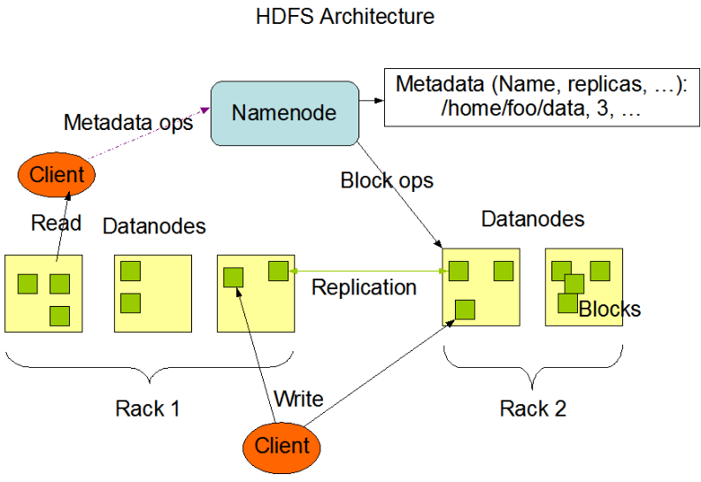
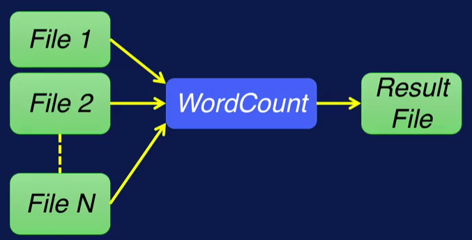

# Introduction to Hadoop

The Apache Hadoop  is an open-source software framework that allows for the distributed processing of large data sets across clusters of computers using simple programming models (MapReduce). It is designed to scale up from single servers to thousands of machines, each offering local computation and storage.   http://hadoop.apache.org/  

Doug Cutting (one of the founders of Hadoop).

You can build Hadoop stacks yourself downloading from apache Hadoop or download the pre-built software stacks from the below companies. 
Cloudera, Hortonworks and MapR  provide the core pre-built software stacks for free and offer commercial support for production environments. 

[Apache Hadoop ecosystem    over 100 projects.](https://hadoopecosystemtable.github.io/)

[Cloudera link](https://www.cloudera.com/products/open-source/apache-hadoop/hdfs-mapreduce-yarn.html)

## The main parts of Hadoop:

**HDFS** The Hadoop distributed file system is a scalable, fault-tolerant (reliable), distributed storage system that works closely with a wide variety of concurrent data access applications.  HDFS is the foundation for many big data frameworks. https://hortonworks.com/apache/hdfs/

HDFS achieves scalability by partitioning or splitting large files across multiple computers. This allows parallel access to very large files since the computations run in parallel on each node where the data is stored.

HDFS replicates file blocks on different nodes to prevent data loss. By default, HDFS maintains three copies of every block. 

HDFS is comprised of two components. NameNode, and DataNode. These operate using a master slave relationship. 

There is usually one NameNode per cluster, a DataNode however, runs on each node in the cluster. 

The **NameNode** is responsible for metadata. It coordinates operations of the HDFS cluster. 
The NameNode records the name, location in the directory hierarchy. The NameNode decides which data nodes to store the contents of the file and remembers this mapping. 

The **Data Nodes** is responsible for storing the file blocks. The Data Node runs on each node in the cluster.  
The Data Node listens to commands from the name node for block creation, deletion, and replication. Replication provides two key capabilities. Fault tolerance and data mortality. 

**YARN** Yet Another Resource Negotiator provides flexible scheduling and resource management over the HDFS storage. It enables to process data in multiple ways simultaneously—for batch, interactive and real-time data workloads on one shared dataset.  https://hortonworks.com/apache/yarn/

**MapReduce** , a programming model for parallel processing of large data sets.

Map and reduce are two concepts based on functional programming.

The Map Reduce simplified model:

Map > apply()
Reduce > summarize()

You provide a function, or operation for a map, and reduce. 
And the runtime executes it over the data. For map, the operation is applied on each data element. And in reduce, the operation summarizes elements in some manner. 
WordCount Map Reduce example.
WordCount reads one or more text files, and counts the number of occurrences of each word in these files. The output will be a text file with a list of words and their occurrence frequencies in the input data. 

0 File is stored in HDFS

1 Map on each node  Map generates key-value pairs   
  
2 Sort and Shuffle  Pairs with same key moved to same node   

3 Reduce    add values for same keys     

https://hortonworks.com/apache/mapreduce/

https://hadoop.apache.org/docs/stable/hadoop-mapreduce-client/hadoop-mapreduce-client-core/MapReduceTutorial.html

**Hive** has a SQL-like interface that adds capabilities that help with relational data modelling. 

**Pig** is a high level data flow language that adds capabilities that help with process map modelling. 
     
**Cloudera Impala** is Cloudera's open source massively parallel processing (MPP) SQL query engine for data stored in a computer cluster running Apache Hadoop. 

**Sqoop/Flume**	Puts data into cluster in relational db format

**Spark** is a fast and general compute engine for Hadoop data. Spark provides a simple and expressive programming model that supports a wide range of applications, including ETL, machine learning, stream processing, and graph computation.

**Mahout** is a Scalable machine learning and data mining library.

**HBase** is a scalable, distributed database that supports structured data storage for large tables.

**Cassandra** is a scalable multi-master database with no single points of failure.

**ZooKeeper** is a high-performance coordination service for distributed applications.

https://hadoop.apache.org/

## Exercises:

Install VirtualBox and Cloudera Quickstart_vms 5-8 on your computer. [Instruction](exercises/Instalation_InstructionsVirtualBox_QuickstartVM5.8.txt)

Copy files into and out of the HDFS via command-line interface. [Instruction](exercises/HDFS_Instruction.txt)

Perform MapReduce WordCount and copy the results from WordCount out of HDFS. [Instruction](exercises/MapReduce_Instruction_v1.txt)

Scoop and Hive https://www.cloudera.com/developers/get-started-with-hadoop-tutorial/exercise-1.html